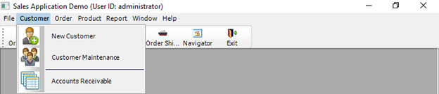
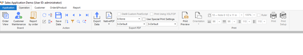
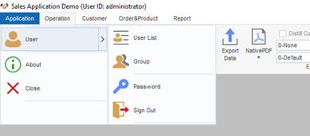
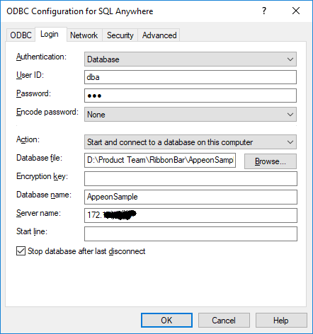
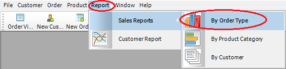
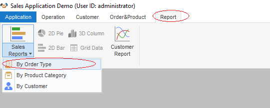
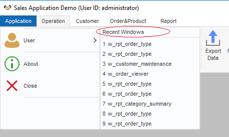

# Tutorial: How to Replace an Application Menu with a RibbonBar

## Overview

The new RibbonBar control allows you to organize the navigation of your application in a simple, structured way, and gives the application the look and feel of modern applications. Because RibbonBar is provided in
PowerBuilder as a control while Menu is a system object, the way that a RibbonBar works in an application is different from the application menu. This tutorial uses a demo application to walk you through the steps of replacing an application menu with a RibbonBar.

The figure below shows what the menu looks like in the original demo application.



The figure below shows what the RibbonBar control looks like after you use it to replace the menu in the application.



This tutorial contains the following sections:

- [Prerequisites](#prerequisites)

  This explains how to set up the demo application used in the tutorial.

- [Design and create a RibbonBar](#design-and-create-a-ribbonbar)

  You shall have a clear understanding of your application to know how to design and create a RibbonBar for it.

- [Add the RibbonBar to the application](#add-the-ribbonbar-to-the-application)

  The RibbonBar will replace the existing menu in the application. Therefore, you must disable the existing menu before adding the RibbonBar.

- [Initiate the RibbonBar](#initiate-the-ribbonbar)

  The RibbonBar needs to be initiated after created by XML/JSON, or PowerScript.

- [Define and bind user events with RibbonBar items](#define-and-bind-user-events-with-ribbonbar-items)

  The ribbon item controls have no events and must be bound with user events.

- [Associate functions with RibbonBar items](#associate-functions-with-ribbonbar-items)

  Previously the application functions are all associated with menu items. You need to decide which function to associate with which RibbonBar item.

- [Summary notes](#summary-notes)

  Finally, this section highlights the major points you should consider when you start to replace the menu in your application with RibbonBar.

## Prerequisites

Step 1: Install PowerBuilder 2019 R3.

Step 2: Download the RibbonBar demo application [from here](https://github.com/Appeon/PowerBuilder-RibbonBar-Example).

Step 3: Set up the sample database.

1. Get the database file \"AppeonSample.db\" from the downloaded demo application.

2. Set up the ODBC database connection.

   i.  Open Control Panel \> System and Security \> Administrative Tools \> ODBC Data Sources.

   ii. Create a new Data Source in SQL Anywhere 17.

   iii. Fill in the following data source configurations. Note that username and password for data source connection is "dba" and "sql\".

   
   
   iv. In PowerBuilder, setup and connect to the created ODBC data source.

   

## Design and create a RibbonBar

As the first step, you shall design the RibbonBar, that is, deciding what items to contain in the RibbonBar, what modern-looking image to use for each item, and how to group the items, etc.

Once you know clearly how you want the RibbonBar to look like, you can start to create it. We recommend you use the RibbonBar Builder tool to create the RibbonBar XML/JSON file. Alternatively, you can choose to
directly create a RibbonBar via PowerScript.

For detailed instructions on how to create a RibbonBar, refer to PowerBuilder Help \> RibbonBar control. In the Sales Demo application, for better illustration purpose, you will see both the XML file and PowerScript code are provided for creating the RibbonBar. When the application initiates the RibbonBar, it uses an argument in the wf\_init\_ribbonbar function to decide which way (XML or PowerScript) to use for creating the RibbonBar (see [Initiate the RibbonBar](#initiate-the-ribbonbar)).

**Creating the XML for the RibbonBar in this demo (Recommended):**

A dedicated tool, RibbonBar Builder, is available in PowerBuilder to assist you to create the RibbonBar XML (or JSON). In the tool, you can use a template (RibbonBar.xml) to create your own XML, and preview the
RibbonBar UI while you work. This is the recommended approach.

In the Sales Demo application:

1. Open Tools \> RibbonBar Builder in PowerBuilder IDE, and open and edit the file created for the RibbonBar: *SalesApplicationDemo\_RibbonBar.xml*.

**Creating the PowerScript for the RibbonBar in this demo:**

In the Sales Demo application:

1. Open the function w\_mdi.wf\_init\_ribbonbar, and you will see the PowerScript for the RibbonBar in the function. The script is different from XML, but shall still be easy to understand.

   For example, the following script inserts File as a RibbonBar category, adds an orderview panel in this category, and then adds buttons inside the panel.

   ```
   //File menu
   long ll_handle, ll_category, ll_panel, ll_group
   RibbonSmallButtonItem lrs_item
   Ribbonmenu lrm_menu
   ribbonLargeButtonItem lrl_item
   ribbongroupitem lrg_item
   long ll_return, ll_tmp, ll_tmp2
   //Insert a category
   ll_category = arbb.insertcategoryfirst ("File") 
   //orderview
   //Insert a panel
   ll_panel = arbb.insertpanellast (ll_category, "OrderView", "orderview.png") 
   //Insert buttons
   arbb.insertLargebuttonlast (ll_panel, "Orders", "orderview.png", "ue_orderview") 
   arbb.insertLargebuttonLast (ll_panel, "Print", "printbig.png", "ue_orderview_print")
   ```

## Add the RibbonBar to the application

### Replacing the existing menu with an empty one

After the RibbonBar is applied, the previous menu will no longer be used in the application. You can create an empty menu and assign it to the MDI window, as a menu is required for all MDI frame windows (the
MenuName property for the MDI window must be set).

1. Use New \> PB Object \> Menu to create a new menu object. It is unnecessary to define any menu item for the menu or attach any script to it. If you do add a menu item, make sure the item shall be
   set to invisible.
2. Assign the empty menu to the MDI window.

In the Sales Demo application, we created the menu object m\_mdi\_none and assigned it to the MDI window. The menu object contains one main menu and one submenu. Note that the submenu item is set to invisible.

### Inserting a RibbonBar control to the MDI window

Insert the RibbonBar control into the MDI window. Note that you must resize the width and height for RibbonBar area in correspondence with the MDI client area to make sure the RibbonBar fits well in the MDI
window.

In the Sales Demo application:

1. Insert the RibbonBar control into the MDI window (from menu: Insert \> Control \> RibbonBar in PowerBuilder IDE).

2. Add the following code to the `Resize` event of the MDI window:

   ```
   //resize RibbonBar
   rbb_1.move(0, newheight - this.workspaceheight())
   rbb_1.width = newwidth
   //resize mdi_1 based on RibbonBar
   mdi_1.move (0, rbb_1.height + newheight - this.workspaceheight())
   mdi_1.resize (newwidth, newheight - rbb_1.height - ( newheight - this.workspaceheight()))
   ```

### Disabling ControlMenu in sheet windows

Because the RibbonBar control applies to the whole application, and the RibbonBar control usually contains a tab button to close the sheet window, it is no longer necessary to provide the Control Menu in the sheet windows. Make sure to design the new RibbonBar to contain a Close/Exit tab button so that the sheet window can be closed after the Control Menu is disabled.

In the Sales Demo application:

1. Open every sheet window (for example, w\_sheet), and uncheck the ControlMenu property in the General tab of the Properties window.
2. Add the close/exit tab button to the RibbonBar top-right corner when we [design and create a RibbonBar](#design-and-create-a-ribbonbar).

## Initiate the RibbonBar

In the [Design and create a RibbonBar](#design-and-create-a-ribbonbar) section, we create the RibbonBar for the application in two ways: by XML/JSON or by PowerScript. We can initiate the RibbonBar created in either way.

### Initiating the RibbonBar created by XML

In the Sales Demo Application:

1. Add an instance variable in the MDI window.

   ```
   String is_Ribbonbar_XML_Name = "SalesApplicationDemo_RibbonBar.xml"
   ```

   > **Note**
   >
   > Make sure this XML file exists in the specified location at the client when the PowerBuilder executable application is deployed and run at the client.

2. Initiate the RibbonBar control in the `open()` event of the MDI window. The second argument must be True, indicating that the RibbonBar will be initiated using XML.

   ```
   wf_init_ribbonbar (rbb_1, True)
   ```

3. In the `wf_init_ribbonbar` function of the MDI window, load the RibbonBar from the XML file.

   ```
   If ab_LoadXML Then
    arbb.ImportFromXMLFile(is_Ribbonbar_XML_Name)
    return
   End If
   ```

### Initiating the RibbonBar created by PowerScript

In the Sales Demo Application:

1. Initiate RibbonBar menu in the `open()` event of the MDI window. The second argument must be False, indicating that the RibbonBar will be initiated using PowerScript.

   ```
   wf_init_ribbonbar(rbb_1,False)
   ```

## Define and bind user events with RibbonBar items

The ribbon item controls have no events, you should define a number of user events accordingly, move the scripts from the original menu events to the user events, and then bind the user events with the corresponding ribbon item control.

The ribbon item controls support the following user events:

- RibbonCheckBoxItem, RibbonLargeButtonItem, RibbonMenuItem, RibbonSmallButtonItem and RibbonTabButtonItem: You can create and bind the clicked and selected user events with them.
- RibbonComboBoxItem: You can create and bind the modified, selected, and selection changed user events with it.

When defining a user event for the ribbon control, make sure the argument (quantities and types) of the event is properly defined according to the requirement of the ribbon control. If the number of
arguments or the argument type does not match with the requirement of the ribbon control, the event will not be triggered.

For example, in the Sales Demo Application, we want to create and bind the clicked user event with the Order View large button. The RibbonLargeButtonItem control requires that the clicked user event have
a long-type argument and return no value. Therefore, in the `rbb_1` RibbonBar control, we create an event with its name as `ue_orderview`, argument name as `al_handle`, argument type as `long`, and the following
script:

```
// ue_orderview (long al_handle) returns (none)
opensheet (w_order_viewer, parent, 0, Original!)
```

And then we bind the `ue_orderview` user event with the clicked event of the Order View large button using this script:

```
arbb.InsertLargeButtonFirst (ll_Itemhandle_Panel, wf_SetLargetButtonItem_Pro ("Order View", "OrderView", ".\picture\orderview.png", "ue_orderview", True, "", "", "ctrl+shift+O"))
```

You can also bind the `ue_orderview` user event with the clicked event of the Order View large button using the XML file:

```
...
   <LargeButton Text="Order View" Tag="OrderView" PictureName=".\picture\orderview.png" Clicked="ue_orderview" Shortcut="ctrl+shift+O" />
...
```

Different ribbon controls require different arguments and types for the user event. For details, see the corresponding user events:

[Clicked](https://docs.appeon.com/appeon_online_help/pb2019r2/powerscript_reference/ch09s16.html#clicked_event_syntax6)

[Selected](https://docs.appeon.com/appeon_online_help/pb2019r2/powerscript_reference/ch09s118.html#selected_event_syntax1)

[Modified](https://docs.appeon.com/appeon_online_help/pb2019r2/powerscript_reference/ch09s76.html#modified_event_syntax1)

[SelectionChanged](https://docs.appeon.com/appeon_online_help/pb2019r2/powerscript_reference/ch09s119.html#selectionChanged_event_syntax4)

## Associate functions with RibbonBar items

Previously the application functions are all associated with menu items. You need to decide which function to associate with which RibbonBar item now. In the Sales Demo application, you can see clearly how a function that is previously associated with a menu item is now associated with a RibbonBar item. In this tutorial, let's explain two examples.

### Example 1: Opening the "By Order Type" report

In the original application, the "By Order Type" report is opened from Report \> Sales Reports \> By Order Type menu item.


The new application uses the Report \> Sales Reports \> By Order Type RibbonBar item to open the report.



**PowerScript in the previous menu item m\_report1.m\_salesreports.m\_byordertype:**

```
str_rptparm lstr_parm

lstr_parm.ftitle = 'Sales Report by Order Type'
lstr_parm.fdataobject = ""
opensheetWithParm (w_rpt_order_type, lstr_parm, parentwindow, 0, Original!)
```

**PowerScript in the event ue\_rep\_ordertype of the RibbonBar:**

```
str_rptparm lstr_parm

lstr_parm.ftitle = 'Sales Report by Order Type'
lstr_parm.fdataobject = ""
opensheetWithParm (w_rpt_order_type, lstr_parm, parent, 0, Original!)

iw_tmp = w_rpt_order_type
wf_setstyle("2D BarStacked")
```

**Key points covered in the PowerScript change:**

- opensheetWithParm (w_rpt_order_type, lstr_parm, parent, 0, Original!)

  As the report item is placed in the RibbonBar panel, the parent object for this item is changed; therefore, the `mdiframe` argument of `OpenSheetWithParm` must be changed from parentwindow to parent.
  The Tag value is migrated into this RibbonBar item. You can find more information for Tag migration in the next example.

- iw_tmp = w_rpt_order_type

  The original toolbar items are migrated as RibbonBar items (small buttons), e.g. 2D Pie, 3D Column, 2D BarStacked/Line and Grid Data items. The items may be enabled or disabled depending on the
  activation of the sheet window. Here we add each opened window into a buffer to track the activation status, so that it can control the status for the RibbonBar items.

- wf_setstyle("2D BarStacked")

  Identify if the report supports 2D BarStacked or 2D Line style. In this example, the small button "2D Bar" is displayed when this report is actively opened.

### Example 2: Opening the "2D BarStacked" report

In the original application, the "2D BarStacked" report is opened from the "2D BarStacked" toolbar item.



The new application uses the Report \> 2D Bar RibbonBar item to open the "2D Bar" report, and then provides the 2D BarStacked option in the report for users to view the 2D Bar Stacked report.


**PowerScript in the previous toolbar item 
m\_report.m\_settings.m\_defaultsettings.m\_reportstyle.m\_item1:**

```
ParentWindow.Dynamic Event ue_Settings(This.Tag)
If This.Checked Then Return
This.Checked = True
m_item2.Checked = False
m_item3.Checked = False
m_item4.Checked = False
m_item5.Checked = False
```

**PowerScript in the event ue\_report\_style of the RibbonBar:**

```
ribbonsmallbuttonitem lrs_item
this.getsmallbutton (al_handle, lrs_item)
string ls_tag
ls_tag = lrs_item.tag
if isvalid (iw_tmp) then
 iw_tmp.dynamic event ue_Settings(lrs_item.tag)
end if
```

**Key points covered in the PowerScript change:**

- The Checked status for the toolbar item is no longer applicable for RibbonBar item.

- ribbonsmallbuttonitem lrs_item
      this.getsmallbutton (al_handle, lrs_item)
      string ls_tag
      ls_tag = lrs_item.tag

  The Tag property is used as the identifier for some business logic of toolbar items. The Tag value needs to be migrated into the RibbonBar item. In this example, we use handle to obtain the Tag value from a RibbonBar item. The report style will be switched based on the Tag value.

- if isvalid (iw_tmp) then
       iw_tmp.dynamic event ue_Settings(lrs_item.tag)
      end if

  The ParentWindow is not applicable for RibbonBar items. And the parent object is not applicable for RibbonBar either, because the parent window is an MDI window instead of a sheet window. The actual
  parent object will be the tracked sheet window in the buffer. The buffer is maintained in the `iw_tmp` object.

### Example 3: Replacing the Close/Exit in sheet windows

In the original MDI window application, the control menu provides the Close button to close the sheet window, and the Exit button to close the application.


When using the RibbonBar, the open, close and refresh functions are now provided in the RibbonBar, and the ControlMenu property should be disabled in the sheet windows.


**PowerScript in the previous w\_sheet object close() event:**

```
parentwindow().post dynamic event ue_closesheet(this.classname())
```

**PowerScript in the w\_sheet object close() event of the RibbonBar:**

```
parentwindow().post dynamic event ue_closesheet(this.classname())
if isvalid(w_mdi) then
 w_mdi.post function wf_refresh_ribbon()
end if
parentwindow().post function Arrangesheets(Layer!)
```

**Key points covered in the PowerScript change:**

- w_mdi.post function wf_refresh_ribbon()

  In the `Close` event of the sheet window, call the `wf_refresh_ribbon` function to refresh the RibbonBar buttons and controls in the MDI window at the closing of the sheet window w\_mdi function. For example, if the 2D BarStacked report window is closed, the current active report supports 2D Line style. The style button in the RibbonBar is refreshed to display the 2D Line button.

- parentwindow().post function Arrangesheets(Layer!)

  In the `Close` event of the sheet window, call the `ArrangeSheets` function to re-arrange all the remaining sheet windows via the `Layer` parameter.

### Example 4: Adding the Application Menu category

The Application Menu category contains the generic application functions, including:

- Recent Windows, listing the recently opened windows;

  

- User, providing the user/group management, password setting, and sign out functions;

  

### Example 5: Including special RibbonBar widgets

There are some special RibbonBar widgets that can further enhance user experience in the application.

For example, the standard RibbonBar buttons for collapsing and expanding, help, and closing functions, as shown below:


## Summary notes

- The RibbonBar can be constructed by a standard XML/JSON file. PowerBuilder provides RibbonBar Builder with preview functionality to assist you to create the XML/JSON file.

- When you apply a RibbonBar to an application, the previous menu in the application shall be removed. It is recommended that you create an empty menu and assign it to the MenuName property of the MDI
  window of the application.

- The ControlMenu property must be disabled for all windows in the application, so that the Control Menu titlebar will not display when a sheet window is maximized.

- Remember to resize the width and height for RibbonBar area and the MDI client area after the RibbonBar is added to the MDI window. This is to make sure the sheet windows opened in the MDI window will display properly together with the RibbonBar.

- If some windows are inherited from an ancient window, you can follow the same way to associate functions with the child windows as with the ancient window.

  If previously some menu items with the same functionality are placed in different sheet windows and you plan to put the menu items in the same panel in the RibbonBar, you can consider to control the
  enable/disable statuses of the RibbonBar items depending on the active status of the sheet windows.

- The window (including MDI window) that contains the RibbonBar control will have the Deactivate event triggered 1) when you click the drop-down arrow to show the Ribbon menu items, or 2) when you
  click the drop-down arrow to show the Ribbon panel items (the drop-down arrow appears when the panel is resized to only show the panel title). When the Window Deactivate event is triggered, the
  control within the window will lose focus.

- The ribbon item controls have no events and must be bound with user events. For more, see [Define and bind user events with RibbonBar items](#define-and-bind-user-events-with-ribbonbar-items).

- If the RibbonBar is created by XML (or JSON), make sure this XML (or JSON) exists in the specified location at the client when the application's executable file is deployed and run at the
  client.